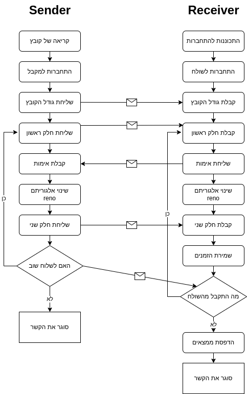

# Network 3 assignment

The purpose of the program is to test the transfer of a file with different percentages of packets loss,
and also the difference between reno and cubic protocols.
The program supports any txt file with the name "send.txt" placed in the directory, and created by herself on "make all".


## Pre-installation

Necessary packages to run the program

```bash
sudo apt-get install git
sudo apt-get install gcc
sudo apt-get install python3
sudo apt-get install iproute2
```
## Installation

first, get the project by typing in the terminal, and compile
```bash
git clone https://github.com/eytan1998/Network_3.git
cd Network_3
make all
```
# How to use
first of all, create random packet loss
```bash
  sudo tc qdisc add dev lo root netem loss 0%
```
change the percentage to the value u want ( =XX)
```bash
  sudo tc qdisc change dev lo root netem loss XX%
```
run the receiver.
```bash
./Receiver
```
and the sender.
```bash
./Sender
```
The program asks if you want to send the file again (enter 'y')(for more samples) or exit (any other key).
As soon as you choose to exit, the time took to receive the file is printed as follow:

1) all the times

2) the average of receiving the first half (cubic algorithm).

3) the average of receiving the second half (reno algorithm).

4) the overall avrage.

# Example of output:
```bash

All times:
        The #1 time: the first part is: 0.837000 ms, second is: 1.186000 ms
        The #2 time: the first part is: 2.147000 ms, second is: 3.121000 ms

First part average (CUBIC): 1.492000 ms
Second part average (RENO): 2.153500 ms
Average time of both parts: 1.822750 ms
```


# Program flow diagram

# Overview
[Receiver.c](https://github.com/eytan1998/Network_3/blob/main/Receiver.c) - is the program that receives the file.

[Sender.c](https://github.com/eytan1998/Network_3/blob/main/Sender.c) - is the program that sends the file.

[helper.c](https://github.com/eytan1998/Network_3/blob/main/helper.c) - is for cleaner code and functions and defines for sender and receiver.

[dinamic_array.c](https://github.com/eytan1998/Network_3/blob/main/dinamic_array.c) - is the data structure of the dynamic array that store the first and second received times, also functions to maintain the data structure and prints the value in format. 

[create_file.py](https://github.com/eytan1998/Network_3/blob/main/create_file.py) - python3 code that creates a text file "send.txt" that the program can send to the receiver,
you can use your file, but the file has to be named "send.txt"
